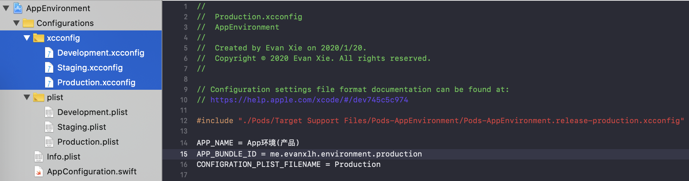
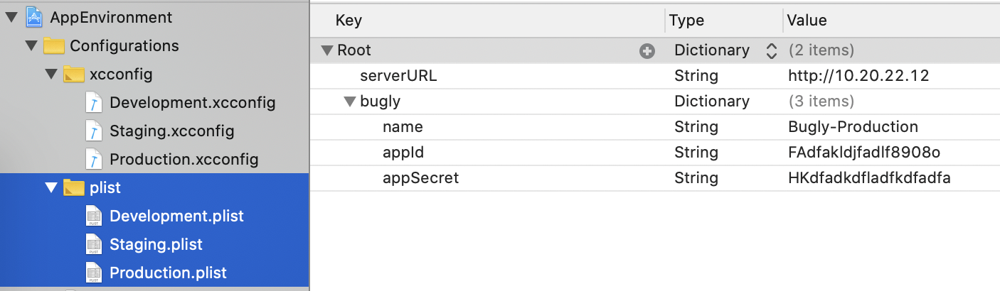
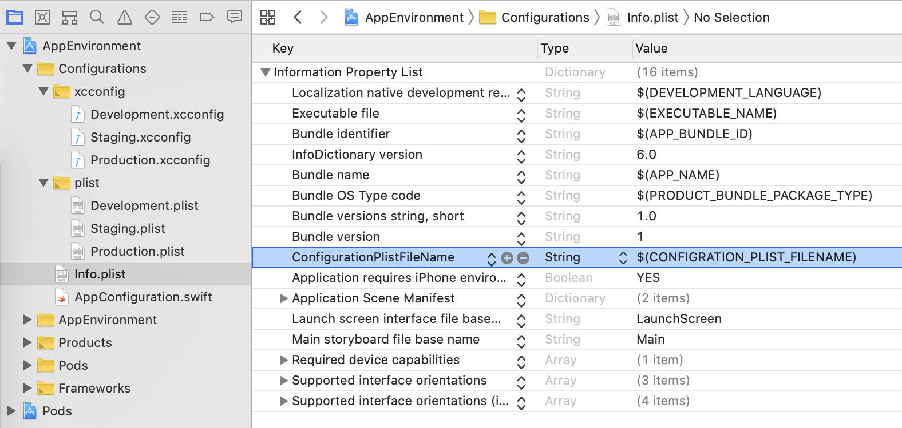
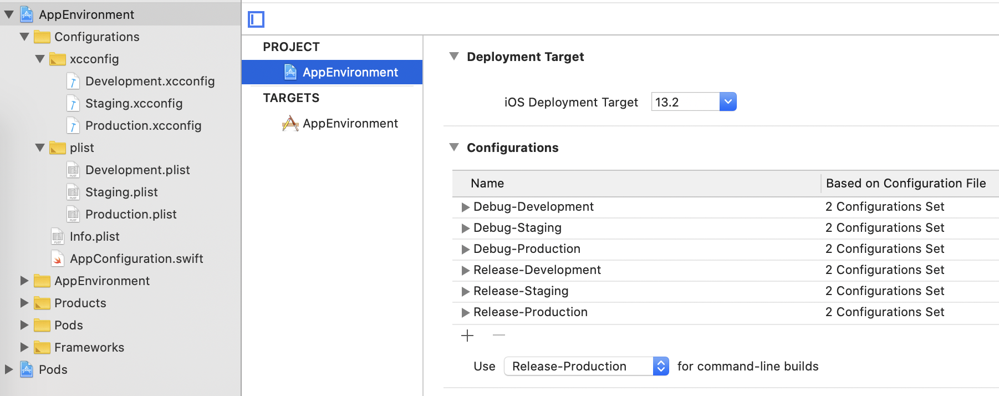
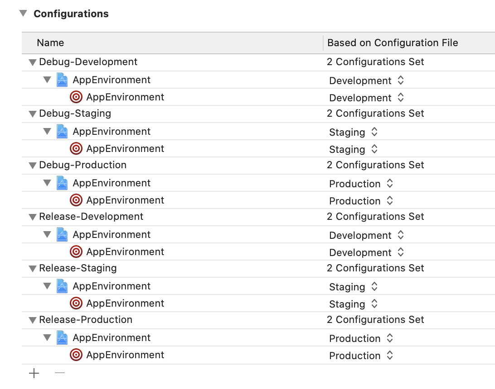
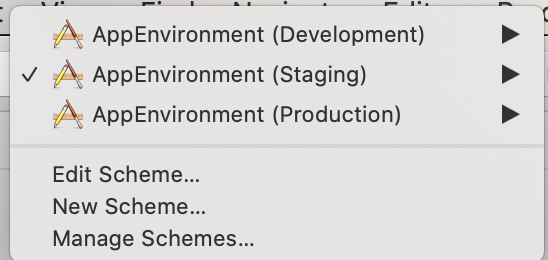
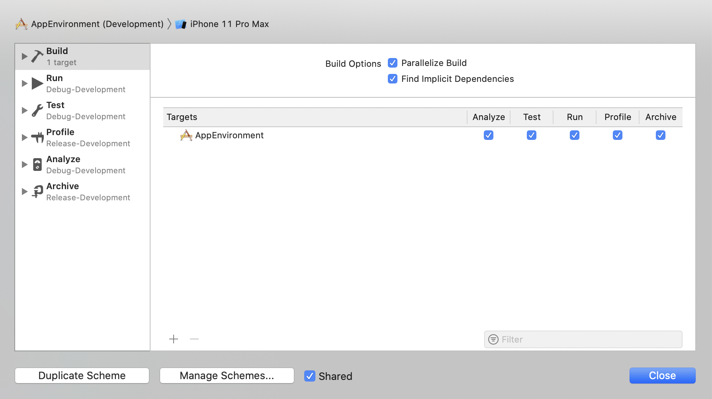

# App 多环境配置探索


## 简介

App开发为什么需要使用多环境呢？原因很简单，就是为了 `App 或 App 新功能` 在对所有用户开放之前能经过充分测试与验证，将问题降到最低，让用户有个好的使用体验。有了多环境，内部测试将完全与发布的产品独立开来，互不影响，这就是多环境的好处。

### 环境配置

App 的环境配置方案有很多种，这里我使用一种个人认为比较好的方式来实现， 即 `xcconfig` 与 `plist` 相结合的方式 。通常情况，我们会给 app 配置 3 个服务器，即 `Development`, `Staging`, `Production`。那 App 又如何配置，才能很方便的去连接这 3 个服务器呢？这就是我们今天想要讨论的问题。 首先，我们将 App 的运行环境分为三种：

- **Development**  
  `Development` 即我们常说的开发环境，开发人员在此环境中开发与自测， 连接 `Development` 服务器。
  
- **Staging**  
  正式产品线上环境前的预演，也就是模拟产品线上环境，连接 `Staging ` 服务器。 QA在 `Staging`上对新版本做最后一轮测试, 通过后才能发布到产品线上。
  
- **Production**  
  最终产品线上环境，连接 `Production ` 服务器，App直接向所有用户开放。
  
###  Debug / Release

iOS App 的工程配置默认包含 `Debug` 和 `Release` 两种模式，那两者有什么区别呢？

- **Debug**  
  `Debug` 为调试模式，编译器不会对代码做最后的优化，包含的程序信息多，非常方便设置断点进行调试。所以这种模式下打包的 App 体积会比较大。
  
- **Release**
   `Release` 为发布模式，编译器最终会对代码做优化，不包含调试信息，所以打包出来的 App 体积更小，运行速度也越快，但不便于调试。
   
<font color=red>所以我们在`环境配置`中提到的 `Development`, `Staging`, `Production` 都会对应 `Debug` 和 `Release` 两种模式。</font>
  

## 实现思路
  
  具体的步骤我就不写了，大家应该都知道如何去做，如果不知道如何操作，可以[参考这里](https://thoughtbot.com/blog/let-s-setup-your-ios-environments)，你也可以在这里[下载完整演示项目Github仓库](https://github.com/ProgramExplore/AppEnvironment)。
  
### 一、新建配置文件 

#### 新建 xcconfig 文件

首先，我们新建 3 个工程配置文件, 例如 `Development.xcconfig`,  `Staging.xcconfig`,  `Production.xcconfig`, 其中的一个配置文件内容如下：
  
```
// 因为使用了 Pods, 所以需要将 Pods 生成的配置文件包含进来. 如果不使用 Pods, 可以去去掉这一行。
#include "./Pods/Target Support Files/Pods-AppEnvironment/Pods-AppEnvironment.release-development.xcconfig"
	
APP_NAME = App环境(开发)
APP_BUNDLE_ID = me.evanxlh.environment.development
CONFIGRATION_PLIST_FILENAME = Development
```



     
#### 新建 Plist 配置文件
 
然后我们新建 3 个 Plist 配置文件，将需要加的其它配置项用 plist 文件来存储，方便解析。例如我们创建以下 3 个 文件: `Development.plist`, `Staging.plist`, `Production.plist`, 其中一个配置文件内容如下: 

```
<?xml version="1.0" encoding="UTF-8"?>
<!DOCTYPE plist PUBLIC "-//Apple//DTD PLIST 1.0//EN" "http://www.apple.com/DTDs/PropertyList-1.0.dtd">
<plist version="1.0">
<dict>
	<key>serverURL</key>
	<string>http://10.20.22.10</string>
	<key>bugly</key>
	<dict>
		<key>name</key>
		<string>Bugly-Development</string>
		<key>appId</key>
		<string>FAdfakldjfadlf8908o</string>
		<key>appSecret</key>
		<string>HKdfadkdfladfkdfadfa</string>
	</dict>
</dict>
</plist>
```



#### 修改 Info.plist

为了能在程序中从 plist 配置文件中读到配置项，我们需要在 `Info.plist` 文件中加入一个 key, 比如命名为: `ConfigurationPlistFileName`, value 设置为`$(CONFIGRATION_PLIST_FILENAME)`， `CONFIGRATION_PLIST_FILENAME `由之前新建的 `xcconfig` 文件定义。这样我们就可以在 App 中加载 plist 配置文件了。



### 二、配置工程

- 首先点击你的工程，如下图所示。然后在 **Configurations**下新增配置，<font color=red>记住 `Development`, `Staging`, `Production` 的 Debug 模式都要从 **Debug**复制出来得到，`Development`, `Staging`, `Production` 的 Release 模式都要从 **Release** 复制出来得到。</font>



- 给 `Development`, `Staging`, `Production` 的 `Debug` 和 `Release` 模式指定对应的 `xcconfig` 文件。



### 三、Plist 配置文件解析

```swift
import HandyJSON

struct AppConfiguration {
    
    fileprivate static let shared = AppConfiguration()
    
    /// The `key` in the `Info.plist` which tells the filename of the configuration plist file.
    fileprivate let keyInInfoPlist = "ConfigurationPlistFileName"
    
    fileprivate var values: Values!
    fileprivate var configurationType: ConfigurationType!
    
    private init() {
        let configInfo = loadConfigurationValues()
        self.values = configInfo.0
        self.configurationType = configInfo.1
    }
    
    fileprivate func loadConfigurationValues() -> (Values, ConfigurationType) {
        guard let filename = Bundle.main.infoDictionary?[keyInInfoPlist] as? String else {
            fatalError("Please specify configuration plist filename in Info.plist")
        }
        
        guard let type = ConfigurationType(rawValue: filename) else {
            fatalError("Not supported configuration name")
        }
        
        guard let url = Bundle.main.url(forResource: filename, withExtension: "plist") else {
            fatalError("Configuration plist file not found")
        }
        
        guard let dic = NSDictionary(contentsOf: url) else {
            fatalError("The format of configuration plist file is invalid")
        }
        
        guard let values = Values.deserialize(from: dic) else {
            fatalError("The format of configuration plist file is invalid")
        }
        return (values, type)
    }
    
}

// MARK: - Public APIs

extension AppConfiguration {
    
    enum ConfigurationType: String {
        case development = "Development"
        case staging = "Staging"
        case production = "Production"
    }
    
    struct OpenPlatform: HandyJSON {
        var name: String = ""
        var appId: String = ""
        var appSecret: String = ""
    }
    
    /// All the configuration values
    struct Values: HandyJSON {
        var serverURL: String = ""
        var bugly: OpenPlatform = OpenPlatform()
    }
    
    /// Type of app configuration which is applied.
    static var type: ConfigurationType {
        return shared.configurationType
    }
    
    /// Accessing all the configuration items by this property.
    static var values: Values {
        return shared.values
    }
}
``` 

最后我们就可以直接用 `AppConfiguration.values` 获取所有的配置项了。

### 三、Scheme 创建

首先分为为 `Development`, `Staging`, `Production` 环境配置 创建 Scheme：  



然后为每一个 Scheme 进行配置：  



### 四、使用 Pods 注意事项

因为我们自己给工程添加了 `xcconfig` 文件，所以 `pod install` 时不会再去设置工程的配置文件。这时需要我们在自己创建的 `xcconfig` 文件中将 Pod 的 `xcconfig` 文件引用进来，然后执行以下操作：  

<font color=red>
1. 删除 `Pods`、`Podfile.lock`、`xcworkspace`文件  
2. 重新执行 `pod install`   
</font>

### 五、结束语

好了，配置完成。

如果一些操作不熟悉，你也可以参考这篇文章：
[https://thoughtbot.com/blog/let-s-setup-your-ios-environments](https://thoughtbot.com/blog/let-s-setup-your-ios-environments)

  
  
  
  